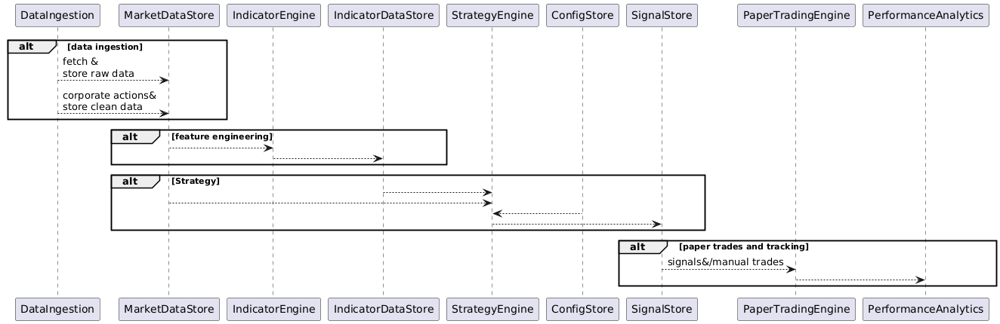
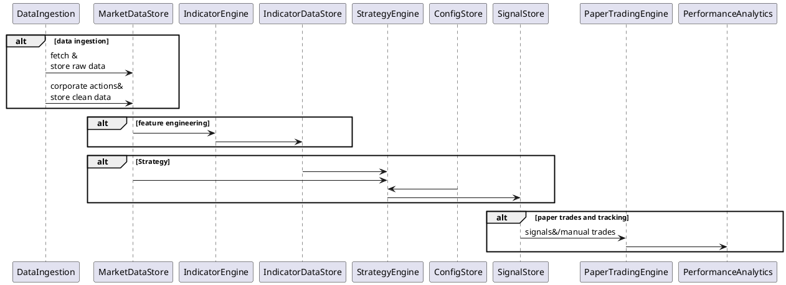
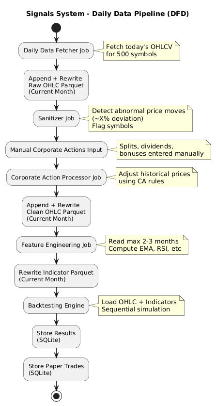

# **Personal Backtesting & Signals System**

**High Level Technical Design (HLD)**

---

## **1\. Big Picture Architecture**

**Goal:**  
 Build a modular Python system that:

* Collects EOD (1D) stock data for Indian equities  
* Computes indicators  
* Runs evolving strategies  
* Generates signals  
* Stores paper trades for later analysis

All components are **script-driven**, **manually or cron-triggered**, and **laptop-friendly**.

---

### **1.1 Module Interaction (Big Picture)**

  



## **2\. Core Modules & Responsibilities**

| Module | Responsibility |
| ----- | ----- |
| Data Ingestion | Fetch historical & daily OHLCV data |
| Raw Data Store | Persist unadjusted market data |
| Processed Data Store | Adjust historical data safely accounting for corporate actions |
| Indicator Engine/Feature Engineering | Compute EMA, RSI, etc |
| Strategy Engine | Generate buy/sell signals |
| Risk Engine | Apply capital, risk %, R:R rules |
| Signal Store | Persist generated signals |
| Paper Trading Engine | Simulate trades without capital |
| Performance Analytics | Evaluate strategy effectiveness |
| Configuration Store | Centralized strategy & risk configs |

---

## **3\. Module Deep Dive**

---

### **3.1 Data Ingestion Module**

Purpose:  
 Fetch historical and daily stock price data.  
Sub-components

* Stock universe loader (Top 500 by market cap)  
* Historical backfill job  
* Daily incremental job

Tech / Tools

* Python  
* requests  
* Data source: NSE/BSE APIs, paid API later (Zerodha, Dhan)

Input

* Stock symbol list  
* Date range

Output

* Raw OHLCV records stored in raw data store

---

### **3.2 Processed Data Store**

Purpose:  
 Ensure historical continuity after splits, bonuses, dividends.  
Key Responsibilities

* Detect splits/bonuses  
* Adjust historical prices & volumes  
* Prevent false signals

Input

* Raw OHLCV  
* Corporate action metadata/Auto detect and fix data

Output

* Adjusted OHLCV series  
* Store in another store

---

### **3.3 Indicator Engine/Feature Engineering**

Purpose:  
 Generate higher-order data from price series.  
Indicators

* EMA (9, 26\)  
* RSI  
* Volume averages  
* Extensible design

Tech

* Python  
* pandas  
* numpy

Input

* Secondary/Processed/Clean OHLCV data

Output

* Indicator values per stock per day

---

### **3.4.1 Strategy DSL and Parser**

**Purpose:**  
We should have a strategy DSL to define strategies built using technical indicators, so that, new strategies can be created/modified/cloned and used without writing too much code

**DS Parser would**

* Deserialize the strategy and create Strategy Domain Object  
* This object would be the input to the Backtesting Engine  
* Along with this, there will be custom analysis/logics as mentioned by me for IPO, Bonds, etc, which need not be gone through the DSL route

Input

* Strategy DSL

Output

* Strategy Domain Object

There would be 3 buckets of strategies

* Indicators and Prices  
* IPO, Bond, Interest Rate, Gold, Indices, correlation, etc  
* Custom strategies basis trend. Examples  
  * start with capital of 1L and max cap as 2L,  
  * for every 2% increase in price over a week Mon to Fri, on next Mon, add 5% to the position  
  * If Friday has opened with a gap up, Take buy position on Monday  
  * give me how many wins/losses and what is the final capital , etc. Max capital reach, min reached, max drawdowns, etc other information  
  * execute this in a given range, on these companies, etc filters

### **3.4.2 Backtesting Engine**

**Purpose:**  
 Apply trading logic on indicators or raw data.  
**Examples**

* EMA crossover  
* RSI oversold/overbought  
* Volume breakout

**Characteristics**

* Stateless per run  
* Easily versioned  
* Out-of-sample friendly

**Input**

* Indicators  
* Strategy configuration

**Output**

* Buy/Sell/Hold signals

---

### **3.5 Risk Engine**

**Purpose:**  
 Convert signals into position-sized trades.

**Responsibilities**

* Apply capital constraints  
* Risk per trade (%)  
* Risk-reward enforcement

**Input**

* Signal  
* Capital config

**Output**

* Position size  
* R:R of the signal  
* Entry/exit levels

---

### **3.6 Signal Store**

**Purpose:**  
 Persist generated signals for audit & replay.

**Stored Data**

* Strategy version  
* Signal timestamp  
* Confidence score (future-ready)

---

### **3.7 Paper Trading Engine**

**Purpose:**  
 Simulate real trading without capital.  
**Behavior**

* Execute trades at next candle open  
* Track PnL, drawdown, hit ratio  
* No look-ahead bias

**Input**

* Signals  
* Market data

**Output**

* Simulated trades  
* Performance metrics

---

### **3.8 Performance Analytics**

**Purpose:**  
 Evaluate strategy quality.

**Metrics**

* Win rate  
* Max drawdown  
* Sharpe (basic)  
* Equity curve

**Output**

* CSV reports  
* Summary tables

---

## **4\. Data Store Design**

---

### **4.1 Data Volume Estimation**

* 500 stocks  
* \~250 trading days/year  
* 1 row/day/stock

**Total rows:**  
 `500 × 250 = 125,000 rows` (very small)

---

### **4.2 Database Options**

| DB | Why |
| ----- | ----- |
| SQLite | Simple, zero-setup, laptop-friendly |
| PostgreSQL | Scalable, future-proof |
| DuckDB | Great for analytics & backtests |

**Phase 1 Recommendation:** SQLite or DuckDB

---

### **4.3 Data Domains**

| Domain | Description |
| ----- | ----- |
| Configuration | Capital, risk, strategy params |
| Raw Market Data | OHLCV |
| Adjusted Market Data | Post corporate actions |
| Indicator Data/Features | EMA, RSI, etc |
| Signals | Strategy outputs |
| Paper Trades | Simulated executions |
| Performance | Analytics results |

---

### **4.4 SQL Schema (dbdiagram.io)**

```sql
Table stocks {  
 id int \[pk\]  
 symbol varchar  
 name varchar  
}

Table raw\_prices\_1D {  
 id int \[pk\]  
 stock\_id int \[ref: \> stocks.id\]  
 date date  
 open float  
 high float  
 low float  
 close float  
 volume bigint  
}

Table indicators {  
 id int \[pk\]  
 stock\_id int \[ref: \> stocks.id\]  
 date date  
 ema\_9 float  
 ema\_26 float  
 rsi float  
}

Table strategies {  
 id int \[pk\]  
 name varchar  
 version varchar  
 description varchar  
 dsl varchar  
}

Table signals {  
 id int \[pk\]  
 stock\_id int \[ref: \> stocks.id\]  
 strategy\_id int \[ref: \> strategies.id\]  
 date date  
 signal\_type varchar  
}

Table paper\_trades {  
 id int \[pk\]  
 signal\_id int \[ref: \> signals.id\]  
 entry\_price float  
 exit\_price float  
 pnl float  
}
```

---

## **5\. Daily Job Data Flow**



```

@startuml
title Signals System – Daily Data Pipeline (DFD)

start

:Daily Data Fetcher Job;
note right
Fetch today's OHLCV
for 500 symbols
end note
:Append + Rewrite
Raw OHLC Parquet
(Current Month);

:Sanitizer Job;
note right
Detect abnormal price moves
(~X% deviation)
Flag symbols
end note

:Manual Corporate Actions Input;
note right
Splits, dividends,
bonuses entered manually
end note

:Corporate Action Processor Job;
note right
Adjust historical prices
using CA rules
end note
:Append + Rewrite
Clean OHLC Parquet
(Current Month);

:Feature Engineering Job;
note right
Read max 2–3 months
Compute EMA, RSI, etc
end note
:Rewrite Indicator Parquet
(Current Month);

:Backtesting Engine;
note right
Load OHLC + Indicators
Sequential simulation
end note
:Store Results
(SQLite);
:Store Paper Trades
(SQLite);

stop
@enduml


```


---

## **6\. Miscellaneous Analysis Requirements**

* Will manually feed in 1 year daily data for things like 10Y bond yields, interest rates whenever changes are announced. This data does not have a fixed frequency, hence the manual flow  
* Later want to build just custom scripts to just perform exploratory analysis and derive insights like correlation, etc  
* Also will manually feed in recently launched IPOs, and will fetch prices since the launch date daily OHLCV data like the rest of data  
* Will try to analyse some IPO specific behaviour. This will again be custom scripts to just perform exploratory analysis

---

## **7\. Repository Structure**

`signals/`  
`├── data_ingestion/`  
`│   ├── fetch_history.py`  
`│   └── fetch_daily.py`  
`├── corporate_actions/`  
`│   └── adjust_prices.py`  
`├── indicators/`  
`│   └── indicator_engine.py`  
`├── strategies/`  
`│   ├── base.py`  
`│   └── ema_rsi.py`  
`├── risk/`  
`│   └── risk_engine.py`  
`├── paper_trading/`  
`│   └── simulator.py`  
`├── analytics/`  
`│   └── performance.py`  
`├── db/`  
`│   └── models.py`  
`├── config/`  
`│   └── settings.yaml`  
`└── main.py`

---

## **8\. Phase Scope**

### **Phase 1 (Current)**

* 1D candles  
* CNC signals  
* Paper trading  
* Manual execution

### **Phase 2 (Future)**

* 5-minute candles  
* WebSocket live feeds  
* Intraday strategies  
* Confidence scoring  
* Partial automation

---

## **9\. Design Philosophy**

* Bias-aware (no look-ahead, survivorship safe)  
* Simple over optimal  
* Research-first, execution-later  
* Strategy iteration over automation

# LLD
Packages structure
- Clients
  - Interface for common methods like get OHLCV 
  - Client factory: checks configuration and gives right impl for client
- Individual implementation of interface
- Models
  - Data models for OHLCV client agnostic  
- Configuration
  - Which client to use for data fetch
  - path to ohlcv data which is outside this repo
  - schemas: schema for ohlcv data and maybe for other tables of sqlite
- Commons
  - Logging
  - Date time utils
  - Http client
  - DB client for both sqlite and DuckDB

- Repository
  - OHLCV raw data repository : interface and DuckDB impl
  - OHLCV clean processed data repository: interface and DuckDB impl
  - Signals repository :interface and SqliteDB impl
  - Paper trades :interface and SqliteDB impl
- Ingestion
  - Backfill job
  - Index backfill job: 
    - queries data for index symbols to backfill for
    - API calls, fetch and parse responses
    - Re write parquet files: can affect as many files as there are months
- Symbol backfill job
    - queries data for stock symbols to backfill for
    - API calls, fetch and parse responses
    - Re write parquet files: can affect as many files as there are months
- Daily refresh job
  - queries data for stock symbols to backfill for
  - API calls, fetch and parse responses
  - Re write parquet files : should affect only 1 file each
- Feature Engineering
  - Empty for now
- Backtester Engine
  - Start with Custom scripts
  - Data Fetcher class -> repository fetches data
  - Strategy Script -> runs and produces output
  - Store output in signals table -> signals repo -> store


- Signals UI
  - Dashboard
    - For some indices, always show, last 1 week, last 1 month, last 6 months, last 1 year returns, 
  - Query filters
    - Given symbol, date range, give returns, highest, lowest, drawdown since its peak

## Schema Design

OHLCV Data
Columns
- date
- open
- close
- high
- low
- volume

### Structure of parquet
signals_data/
  └── raw/
      └── ohlc_1d/
            └── symbol=RELIANCE/
                └── year=2024/
                    └── month=01/
                        └── data.parquet


## Libraries used

- PyArrow: How data is stored & moved efficiently
  - PyArrow is Python bindings for Apache Arrow, a columnar in-memory + on-disk data format
  - The low-level engine behind Parquet, DuckDB, Spark, Polars.
  - Columnar memory layout, Typed, language-agnostic data, Efficient disk format (Parquet)

```
API JSON
   ↓
Domain Objects
   ↓
pandas DataFrame (optional)
   ↓
PyArrow Table  ← schema enforcement happens here
   ↓
Parquet files

```  
- Pydantic: How data is validated & trusted
  - Pydantic is a data validation & parsing library built on Python type hints.
  - Runtime type safety for Python.
  - Explicit data models, Automatic validation

```
External Input
(API / YAML / JSON)
        ↓
Pydantic Model   ← validation boundary
        ↓
Trusted Domain Objects
        ↓
Rest of system
```


## StrategyExecutorFactory

strategy\_type \= config\["strategy"\]\["type"\]

if strategy\_type \== "INDICATOR":  
    executor \= IndicatorStrategyExecutor(config)  
elif strategy\_type \== "POSITION\_SCALING":  
    executor \= PositionScalingExecutor(config)

PositionScalingStrategyExecutor  
for week in weeks:  
    pct\_change \= calculate\_weekly\_change(stock)

    if pct\_change \>= 2:  
        increase\_position(5%)  
    elif pct\_change \<= \-2:  
        decrease\_position(5%)

    enforce\_capital\_constraints()  
    record\_metrics()

## DSLs

strategy:  
  name: "Weekly\_Scale\_In\_Out"  
  type: POSITION\_SCALING

universe:  
  stocks: \["HDFCBANK", "ICICIBANK"\]  
  timeframe: "1D"

capital:  
  start: 100000  
  max: 200000

evaluation:  
  frequency: WEEKLY  
  window: MON\_FRI  
  metric: PRICE\_CHANGE\_PERCENT

rules:  
  \- if: metric \>= 2  
    action:  
      type: INCREASE\_POSITION  
      value: 5%  
  \- if: metric \<= \-2  
    action:  
      type: DECREASE\_POSITION  
      value: 5%

constraints:  
  max\_position\_percent: 100%  
  min\_position\_percent: 0%

outputs:  
  metrics:  
    \- total\_return  
    \- max\_drawdown  
    \- max\_capital\_used  
    \- win\_loss\_ratio

strategy:  
  name: "EMA\_Crossover"

universe:  
  stocks: \["RELIANCE", "TCS", "INFY"\]  
  timeframe: "1D"

indicators:  
  \- name: ema\_fast  
    type: EMA  
    period: 9  
  \- name: ema\_slow  
    type: EMA  
    period: 26

entry\_rules:  
  \- condition: "ema\_fast \> ema\_slow"

exit\_rules:  
  \- condition: "ema\_fast \< ema\_slow"

risk:  
  capital: 100000  
  risk\_per\_trade: 1%  
  position\_type: CNC

Custom scripts

/analysis

  ├── ipo\_analysis.py

  ├── bond\_stock\_correlation.py
